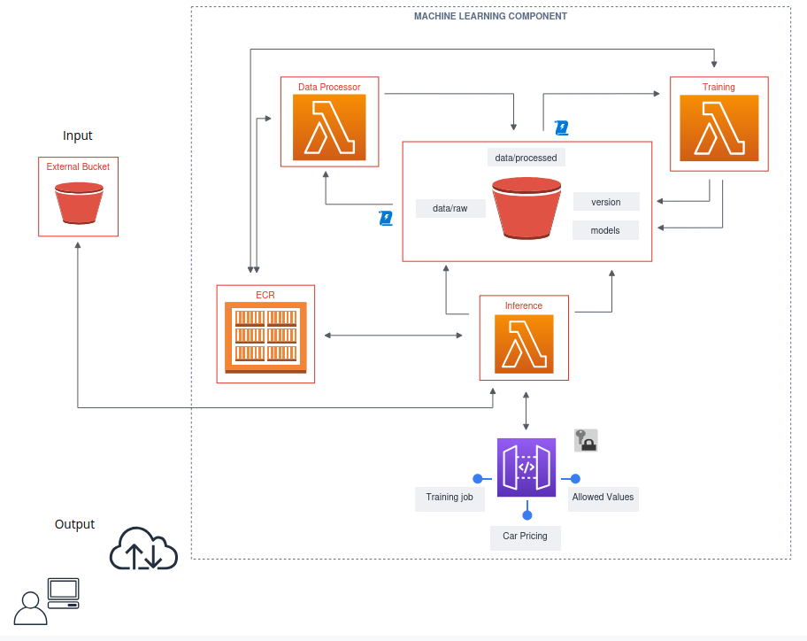

# ml-component
Demonstrates a component-based approach for developing machine learning systems trough a car pricing use case.

## Introduction

The "Machine Learning Component for Car Pricing" project highlights a component-based approach to developing machine learning applications, emphasizing modularity and clear interfaces. By leveraging AWS infrastructure and Lambda functions, this project offers an efficient and scalable solution for car price predictions.

Components can be tested individually, minimizing errors and allowing for rapid improvements without affecting the overall system. Integrating the ML component into a larger project becomes straightforward, reducing disruptions and making updates easier.

### Benefits

- **Modular Architecture**: Enhances maintainability and organization by dividing the system into reusable components, enabling easier updates and independent development.

- **Scalability**: Uses AWS Lambda and API Gateway for automatic scaling and serverless execution, handling varying workloads efficiently without manual intervention.

- **Flexibility**: Allows for straightforward updates or replacements of individual components without affecting the overall system.

- **Automated Workflow**: Streamlines data processing, model training, and predictions with minimal manual input, reducing errors and improving efficiency.

### Limitations

- **Lambda Execution Limit**: AWS Lambda's 15-minute execution limit may restrict model training. Solutions include using AWS Batch or EC2 instances for longer tasks.

- **Prediction Constraints**: The current setup supports single-car predictions. To handle multiple cars, either batch processing services or asynchronous Lambda invocations can be used, with results aggregated as needed.

- **VPC Requirements**: Deploying within a VPC improves security by isolating resources and controlling network access.

- **Incomplete Training endpoint**: The idea of training job creation is to copy the latest dataset from an external S3 bucket. In that case, a bucket policy and a VPC endpoint for S3 will be required.

## API Endpoints

- **`ping`**: Loads the models and verifies access.
- **`values`**: Returns allowed values for a given input feature name.
- **`pricing`**: Predicts car price based on the provided input features.
- **`train_job`**: Initiates a training job by downloading the latest dataset into bucket.

## Infrastructure

All resources are defined using an infrastructure-as-code template with the AWS Serverless Application Model (SAM). The project employs three primary AWS Lambda functions:

1. **Inference Lambda**: Handles API endpoints, mainly the `pricing` endpoint (car price preidiction).
2. **Data Processing Lambda**: Preprocesses the latest data and outputs the processed file to the bucket. Triggered by file uploads in the raw data folder.
3. **Training Lambda**: It loads the preprocessed dataset, trains, evaluates the model, and saves the model with versioning. Triggered by uploads of processed datasets. 

### Architecture Diagram



## Setup

### Prerequisites

- **Git**: Version control system
- **Docker**: Container platform
- **Poetry**: Dependency management tool for Python
- **Python3.9**: Python version

### Installation

1. **Clone the Repository**

    ```bash
    git clone https://github.com/milan-pavlovic-ai/ml-component.git
    cd car-pricing-ml-component
    ```

2. **Create and Activate a Virtual Environment with Poetry**

    ```bash
    make active
    make install
    ```

3. **Environment Configuration**

    Create a `.env` file in the root directory of the project with the following content:

    ```bash
    ENVIRONMENT='local'  # or 'cloud'
    ```
    
    Create `cfg_cloud.env` and `cfg_local.env` files for environment-specific configurations such as bucket name, AWS region, profile, host, and port.

    ```bash
    HOST='localhost'
    PORT='3000'
    BUCKET_NAME='your-s3-bucket-name'
    AWS_REGION='your-aws-region'
    AWS_PROFILE='your-aws-profile'
    ```

    Configure AWS CLI with an IAM user that has sufficient permissions:

    ```bash
    aws configure
    ```

## Running the Application

* ### Running Locally

    Activate the virtual environment and start API server. This will start the API server locally on port 3000.

    ```bash
    make active
    make api_dev
    ```

* ### Running in the Cloud

    To interact with the API in the cloud ensure that requests to the API include the `x-api-key` header with AWS API Key.

    Example using curl:

    ```bash
    curl --location 'https://<your-api-id>.execute-api.<your-aws-region>.amazonaws.com/cloud/pricing' \
    --header 'x-api-key: <your-api-key>' \
    --header 'Content-Type: application/json' \
    --data '{
        "Manufacturer": "BMW",
        "Model": "530",
        "Prod. year": 2017,
        "Category": "Sedan",
        "Mileage": 42000,
        "Fuel type": "Petrol",
        "Engine volume": 3.0,
        "isTurbo": "Yes",
        "Cylinders": 6,
        "Gear box type": "Tiptronic",
        "Drive wheels": "Rear",
        "Wheel": "Left wheel",
        "Color": "Silver",
        "Airbags": 12,
        "Leather interior": "Yes"
    }'
    ```

## Deploy Changes

* **Locally Validate and Build Image**

    ```bash
    make build
    ```

* **Update stack and deploy image to ECR container**

    ```bash
    make deploy
    ```

## Appendix

### AWS SAM Template

The SAM (Serverless Application Model) template defines all AWS resources used in this project (expect IAM user). It includes Lambda functions with Roles, API Gateway configurations, and S3 bucket definitions. You can find the SAM template in the `template.yaml` file.

### Docker image

The project utilizes a Docker image to package and deploy the Lambda functions. The image is defined in a `Dockerfile` and is used to build and push the image to a container registry, such as Amazon Elastic Container Registry (ECR), from which AWS Lambda can pull it during execution.


### IAM User Permissions

Ensure the IAM user used for AWS CLI configuration has permissions for:

    S3: Access to the buckets used for storing datasets.
    Lambda: Execution and management of Lambda functions.
    API Gateway: Management of API Gateway configurations.

### Notebook

The notebook contains Exploratory Data Analysis (EDA) of the dataset which is localted at `notebook/eda.ipynb`. It includes: Descriptive statistics, visualization, outliers removal, and feature selection.

### Dataset

The dataset contains transactions of cars along with their attributes. For more information and to access the dataset, please visit the Kaggle page: [Car Prices Dataset on Kaggle](https://www.kaggle.com/datasets/sidharth178/car-prices-dataset)

### Troubleshooting

* **API Not Responding Locally**:

    Ensure the virtual environment is activated and the API server is running.
    
* **Deployment Issues**:

    Verify AWS credentials and permissions. Review SAM deployment logs for errors.

* **Model Training Errors**:

    Check the Lambda function logs in CloudWatch for details on failures during training or preprocessing.


## Contribution

Contributions are welcome! Please follow these steps:

1. Fork the Repository

2. Create a New Branch: 
    ```bash
    git checkout -b feature/your-feature
    ```

3. Commit Your Changes:
    ```bash
    git commit -am 'Add new feature'
    ```

4. Push to the Branch:
    ```bash
    git push origin feature/your-feature
    ```

5. Open a Pull Request:

    Describe the changes and submit for review.
